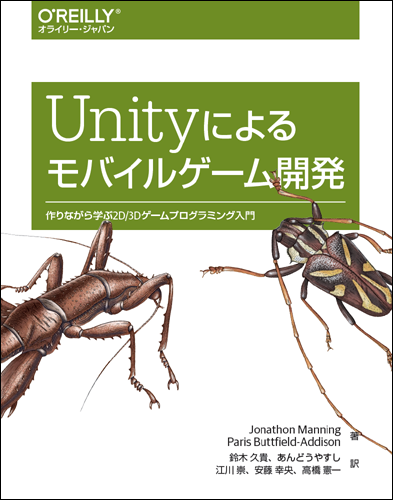

# Unityによるモバイルゲーム開発

---

---

本リポジトリはオライリー・ジャパン発行書籍『[Unityによるモバイルゲーム開発](http://www.oreilly.co.jp/books/9784873118505/)』（原書名『[Mobile Game Development with Unity](http://shop.oreilly.com/product/0636920032359.do)』）のサポートサイトです。

## サンプルコード

サンプルコードの解説は本書籍をご覧ください。

### ダウンロード方法

本書籍を通して作成するプロジェクトの完成プロジェクトは、本Githubリポジトリのサイトの「Clone or download」ボタンを押して、クローンまたはダウンロードすることができます。プロジェクトのダウンロードは以下のURLからも行うことができます。

* [本リポジトリのダウンロード](https://github.com/oreilly-japan/mobile-game-development-with-unity-ja/archive/master.zip)

また、以下のURLから本書籍で作成する2つのゲームに使用するリソースのみをダウンロードすることができます。
中身は、アート、音、モデルなどの、いわゆるリソースデータのみとなっています。プロジェクトの状態にはなっておらず、そのまま動作させることを想定していないため、スクリプトファイルは含んでおりません。

* [Unityの標準アセットに含まれていないアート、音、その他のリソース](https://www.oreilly.co.jp/pub/9784873118505/MobileGameDevWithUnity1stEd-master.zip)

### 使用方法

上記「本リポジトリのダウンロード」からダウンロードするとzip形式の圧縮ファイルでダウンロードされるので展開します。Unityでプロジェクトを開く際には、`2D-Game`、`3D-Game`、`Editor Extentions`を指定してください。

上記「Unityの標準アセットに含まれていないアート、音、その他のリソース」からダウンロードするとzip形式の圧縮ファイルでダウンロードされるので展開します。展開されたフォルダーはUnityプロジェクトにはなっていないので、Unityで直接開くことはできません。`2D-Game[Gnome's Well]`フォルダーは本書籍の第4章から第8章で作成するゲームのリソースを含んでいます。`3D-Game[Rockfall]`のフォルダーは本書籍の第9章から第13章で作成するゲームのリソースを含んでいます。自身で作成したUnityプロジェクトに適宜インポートしてお使いください。

## 実行環境

日本語版で検証に使用した各ソフトウェアのバージョン、およびハードウェアは次のとおりです。

#### ソフトウェア

* Unity 2018.2.0f2
* Android SDK API level 25
* Xcode 9.4.1

#### ハードウェア（括弧内はOSのバージョン）

* Galaxy S6 Edge (Android 7.0)
* Galaxy S9 Edge (Android 8.0)
* iPhone SE (iOS 11.4.1)

## 正誤表

まだありません。誤植など間違いを見つけた方は、japan@oreilly.co.jpまでお知らせください。
